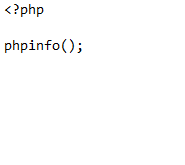

После установки PHP 8 и Apache2 на сервере с Debian 10, я хотел вывести информацию о текущей конфигурации и в целом проверить работоспособность. Перейдя по адресу (ip\_адрес\_сервера/info.php) я увидел:

<figure>

[](https://young-admin.org.ru/wp-content/uploads/2021/08/info_php.png)

<figcaption>

Код info.php

</figcaption>

</figure>

Всё оказалось очень просто, модуль PHP8.0 не был включен в Apache2. 
Проверив путь /etc/apache2/mods-available, что модуль есть, набираем в консоли команду активации модуля:

```bash
# a2enmod php8.0.load
```

После чего перезапускаем Apache2:

```bash
# systemctl restart apache2
```

В итоге, в моём случае успешно заработало и скрипт вывел информацию.
