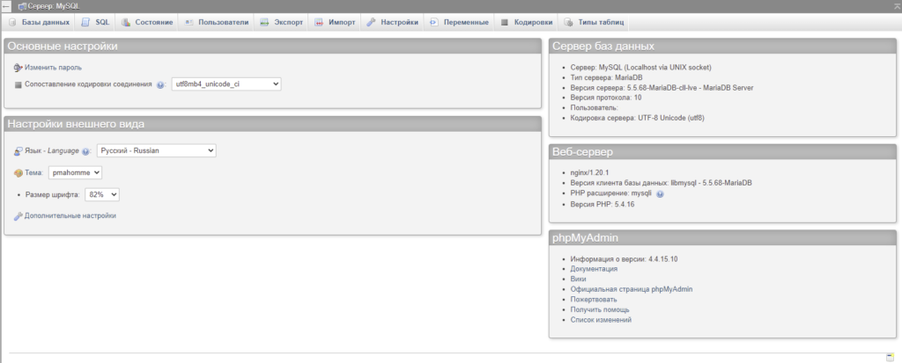
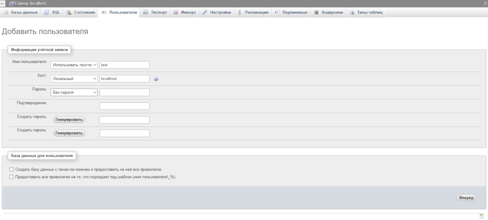
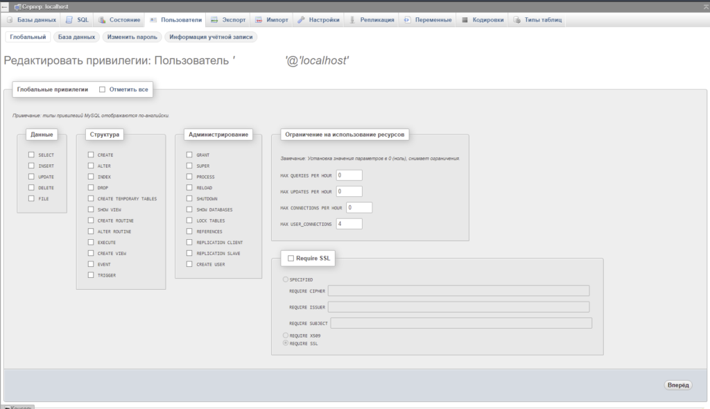
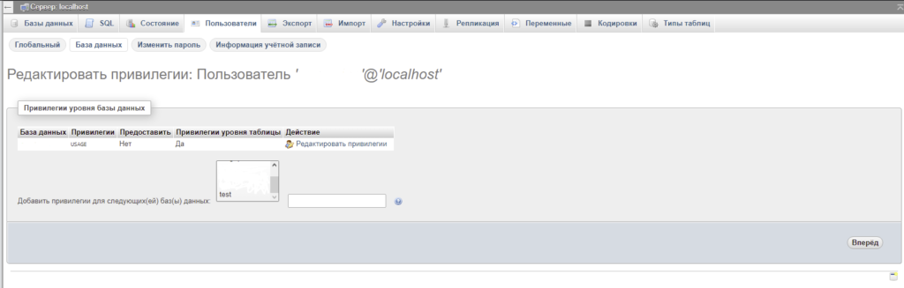
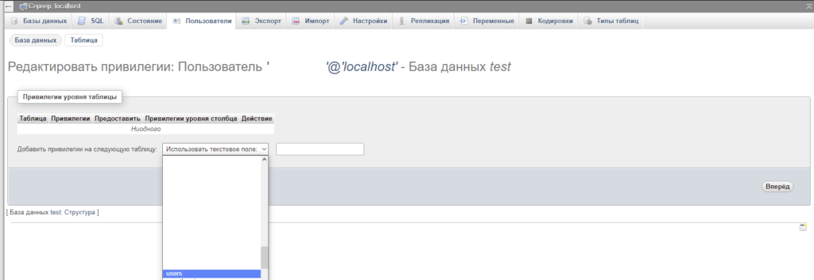
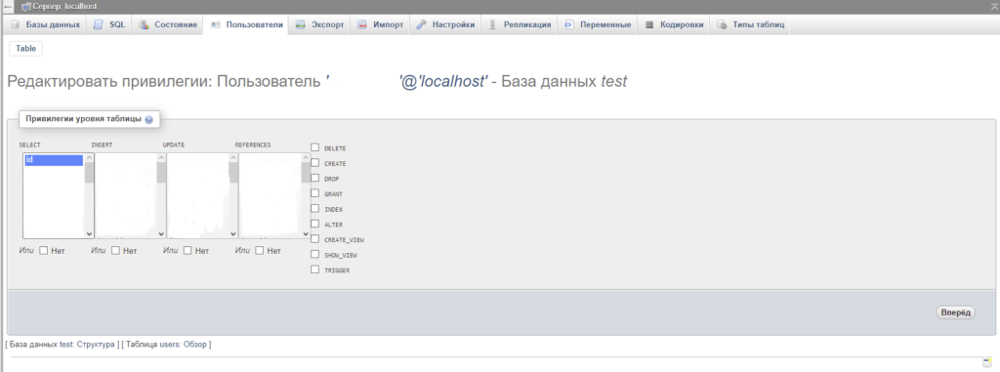

Добавляем пользователя базы данных и предоставляем доступ к некоторым таблицам БД, с возможностью, только выборки(select).  
Вся настройка происходила под root пользователем базы данных, в phpMyAdmin.

##### Алёрт

Если знаете как лучше реализовать, сделать или заметили ошибки - **срочно** пишите комментарий!

1\. Заходим в phpMyAdmin, стандартный путь это ip адрес или домен, например:  
http://192.168.1.10/phpmyadmin/index.php  
http://example.com/phpmyadmin/index.php

<figure>

<figcaption>

Главная phpMyAdmin

</figcaption>

</figure>

2\. Переходим на верхней панели в "Пользователи"  
3\. Добавляем нового пользователя, с нужными нам параметрами. В примере, имя пользователя я указал test, хост локальный (localhost), пароль - без пароля.  

<figure>

<figcaption>

Вкладка пользователи

</figcaption>

</figure>

4\. Редактируем привилегии пользователя test, также через вкладку "Пользователи -> Редактировать привилегии".  
Глобальные привилегии применяются ко всем базам данных на указанном сервере, в моём случае нужно к конкретной БД предоставить доступы. Так что идём дальше.

5\. Переходим на вкладку "База данных", выбираем нужную базу.  
Я выберу базу данных test.

<figure>

<figcaption>

Редактирование привилегий "Базы данных"

</figcaption>

</figure>

6\. Выбираю таблицу users.

7\. Выбираем в столбце "Select" нужные столбцы таблицы, к которым хотим предоставить доступ. Я выберу только доступ к id.

После выполненных шагов мы получим в итоге:  
Пользователя базы данных, с возможность делать только выборку из БД - "Test", таблицы внутри базы с названием "Users" по атрибуту (столбцу) id.  
Можно добавить также другие атрибуты, например если есть в базе атрибуты - последнее время входа/выхода пользователя, почта, логин и т.д.. Тогда при выборке мы сможем получить id пользователя и время его последнего входа, почту, логин и другое.
