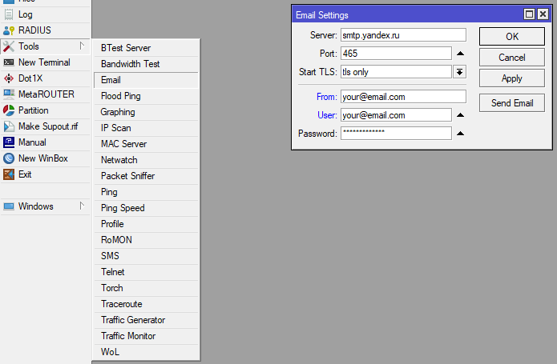
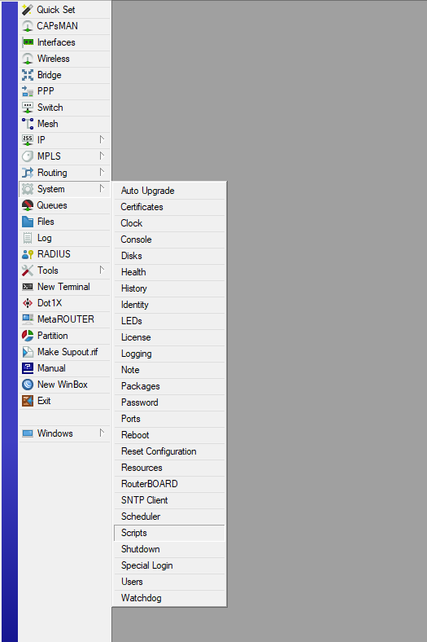
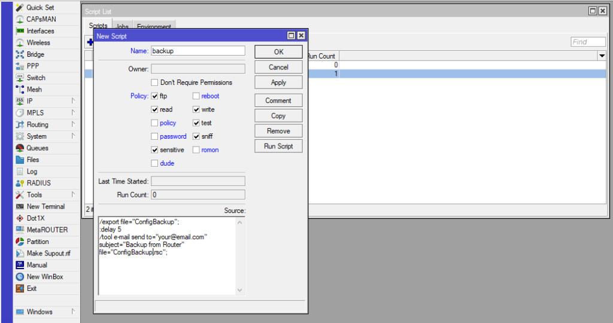

В статье описано как автоматизировать бэкапы настроек Mikrotik с отправкой на электронную почту. Все настройки сохраняются в виде текстового файла с расширением .rsc, который можно открыть любым текстовым редактором, например [Notepad++](https://notepad-plus-plus.org/). Сохранение в текстовом формате, позволяет перенести настройки практически на любой устройство Mikrotik.

##### **Алёрт**

Если знаете как лучше реализовать, сделать или заметили ошибки - **срочно** пишите комментарий!

## Настройка отправки email с Mikrotik

Для возможности отправки писем с нашего устройства, произведём настройку.  
Подключаемся к устройству через WinBox. Открываем "Tools" -> "Email". В открывшемся окне "Email Settings" указываем сервер для отправки почты. Например для Яндекс.Почты, работает также с "почтой для домена (ПДД)".  
Server - smtp.yandex.ru  
Port - 465  
Start TLS - tls only. Согласно документации Mikrotik, режим "tls only" отправляет STARTTLS и прерывает сессию, если TLS не доступен на сервере. Проще говоря отправляет только в защищённом виде.  
А "yes" отправляет STARTTLS и продолжает без TLS, если сервер отвечает, что TLS недоступен. Так как Яндекс работает только по защищенным каналам, во избежание проблем, указываем "tls only".  
From - Имя или адрес электронной почты, который будет отображаться в качестве получателя.  
User - Имя пользователя, используемое для аутентификации на SMTP-сервере.  
Password - Пароль, используемый для аутентификации на SMTP-сервере.

<figure>

[](https://young-admin.org.ru/wp-content/uploads/2021/09/mikrotik_tools_email.png)

<figcaption>

Настройка почты на Mikrotik

</figcaption>

</figure>

## Добавление скрипта на устройстве

Создаём скрипт который будет выполнять бэкап конфигурации Mikrotik и отправлять его на нашу почту. Переходим в "System" -> "Scripts"

<figure>

[](https://young-admin.org.ru/wp-content/uploads/2021/09/mikrotik_system_scripts.png)

<figcaption>

Меню Mikrotik

</figcaption>

</figure>

В открывшемся окне "Script List", нажимаем на синий плюс "Add" и заполняем всё необходимое в окне "New Script".  
Name - название нашего скрипта  
Owner - владелец скрипта, пользователь под которым он будет создан и сохранён. Заполнится автоматически, поле не активное  
Policy - заполняете на своё усмотрение, можете оставить все галочки. Подробнее можно прочитать в [официальном мануале](https://wiki.mikrotik.com/wiki/Manual:Scripting#Script_repository)  
Source - [запишем команды](#код) для выполнения и отправки бэкапа на почту. Не забудьте поменять " your@email.com" на адрес вашей электронный почты, куда будут отправляться бэкапы

<figure>

[](https://young-admin.org.ru/wp-content/uploads/2021/09/mikrotik_backup_script.png)

<figcaption>

Заполняем поля скрипта

</figcaption>

</figure>

```bash
/export file="ConfigBackup";
:delay 5
/tool e-mail send to="your@email.com" subject="Backup from Router" file="ConfigBackup.rsc";
```

## Возможные проблемы

Скрипт отрабатывает, но ничего не происходит - возможно в "Policy" скрипта, была снята галочка с "Write" из-за чего бэкап-файл не может быть записан в память и далее отправлен на почту.
