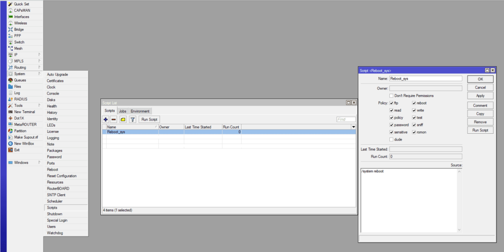
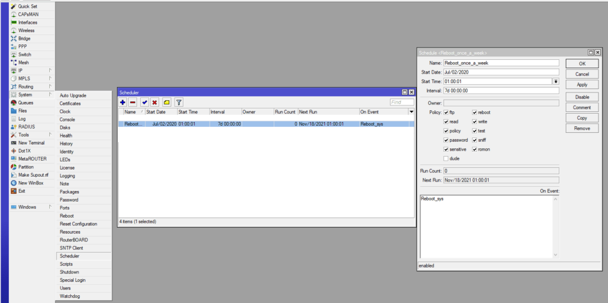

Точка доступа Wi-Fi периодически зависала (один раз, в 2-3 месяца) и помогала перезагрузка устройства. Был сделан небольшой костыль для решения данной проблемы.

## Скрипт перезагрузки

Идём в System -> Scripts нажимаем Add и заполняем следующим образом:

[](https://young-admin.org.ru/wp-content/uploads/2021/11/mikrotik-winbox.png)

\- "Name" название, можно указать любое, дальше оно нам понадобиться  
\- "Policy" оставляем по умолчанию  
\- В "Source" записываем следующую команду, которая просто перезагружает устройство:

```
/system reboot
```

## Запуск скрипта по расписанию

Далее ставим выполнение скрипта по расписанию. Заходим в "System" -> "Scheduler", добавляем расписание и заполняем следующим образом:

[](https://young-admin.org.ru/wp-content/uploads/2021/11/scheduler.png)

\- "Name" - название, можно указать любое  
\- "Start Date" - дата с которой начнется выполнения скрипта  
\- "Start Time" - в какое время запуститься скрипт  
\- "Interval" - период времени, между запуском скрипта  
\- "On Event" - указываем название нашего скрипта, в моем случае "Reboot\_sys"

В итоге, планировщик запускает скрипт с названием Reboot\_sys в 01:00, раз в неделю, перезагружая роутер.
