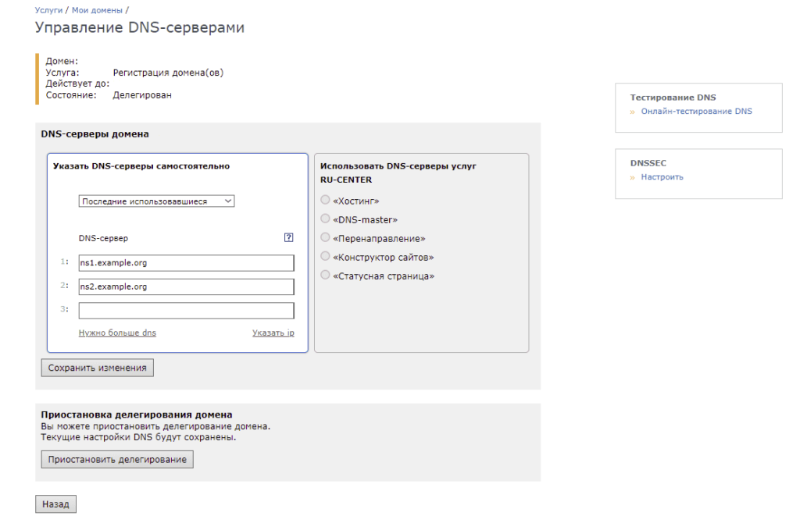
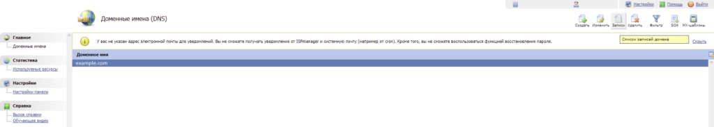
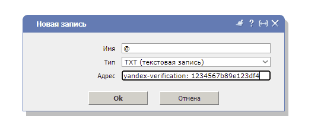

После покупки домена в Nic.ru столкнулся с проблемой его подтверждения в Яндекс.Коннект. Делигирования на DNS сервера Яндекса не достаточно для подтверждения права на домен, необходимо было добавить DNS запись или Метатег или HTML-файл. В моём случае Метатег или HTML-файл, не возможно было добавить, а добавление и редактирование DNS записей в Nic.ru платное :). Далее опишу как я это обошел и подтвердил домен в Яндексе.

## Делигирование домена на DNS сервер

Для подтверждения домена на Яндексе нужно, добавить TXT запись на DNS сервере, на который мы делегировали домен. Я для этого воспользовался бесплатной услугой одного из хостинг провайдеров, что в случае с одноразовым подтверждением то, что нужно.  
Заходим в личный кабинет, "мои домены" и изменяем DNS-серверы нашего домена, на DNS-сервера, любого DNS-хостинг провайдера, который предоставляет данную услугу, с возможностью редактирования записей. В качестве **примера** я указал ns1.example.org.

[](https://young-admin.org.ru/wp-content/uploads/2022/02/nic_dns.png)

Как только домен будет делегирован на наш DNS хостинг, приступаем к следующему шагу.

## Подтверждение

Создаём запись согласно инструкции при добавлении домена в Яндексе, либо данной [инструкции](https://yandex.ru/support/business/domains.html). Заходим в панель управления нашим DNS сервером, внешне они могут отличаться, но принцип у всех один. В примере демонстрируется домен example.com, переходим в редактор записей домена.

[](https://young-admin.org.ru/wp-content/uploads/2022/02/dns.png)

Создаём следующую запись, со своим значением: yandex-verification: 123....

[](https://young-admin.org.ru/wp-content/uploads/2022/02/yandex_verification.png)

После добавление записи, необходимо подождать вплоть до 72 часов, чтобы запись распространилась. Чтобы не ждать несколько суток, можно воспользоваться утилитой DIG в Linux, или любым онлайн сервисом и проверить появилась ли запись:

```bash
dig example.com txt
```

Если запись появилась то возвращаемся в Яндекс.Коннект и нажимаем кнопку "проверить", после умпешной проверки домен будет делегирован на сервера Яндекса.
