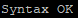

Для того чтобы проверить конфигурационные файлы на корректность и не перезапускать весь Apache сервер, чтобы применить настройки конфигурации, достаточно выполнить следующие действия.  
Сначала запустим [ситаксический тест](https://httpd.apache.org/docs/2.4/programs/apachectl.html) файла конфигурации, он нам сообщит либо что всё ОК, что мы верно написали конфиг, либо сообщит подробную информацию о конкретной ошибке.

```bash
apachectl configtest
```

Если команда нам сообщила:

[](https://young-admin.org.ru/wp-content/uploads/2022/05/apachectl-configtest.png)

То, перезагружаем (перечитываем) конфиги, для их применения.  
Для перезагрузки конфигов Centos:

```bash
service httpd reload
```

Debian/Ubuntu:

```bash
service apache2 reload
```
