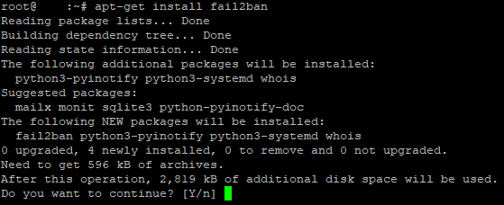
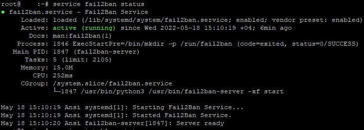
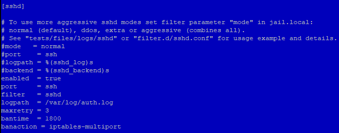

Установим и настроим fail2ban для базовой защиты SSH на Debian 11 bullseye. Я буду ставить fail2ban на свежеустановленную систему.  
Настройка для [Debian 12](https://young-admin.org.ru/zapusk-fail2ban-v-debian-12-dlya-ssh/).

## Установка fail2ban и iptables

Перед установкой программ произведём обновление информации о пакетах и зависимостях в подключенных репозиториях:

```bash
apt-get update
```

Далее устанавливаем сам fail2ban:

```bash
apt-get install fail2ban
#или с ключом (параметром) -y, для установки без запросов подтверждения
apt-get install -y fail2ban
```

На вопрос хотим ли мы продолжить отвечам y:

[](https://young-admin.org.ru/wp-content/uploads/2022/05/prompt.png)

Я буду использовать fail2ban совместно с iptables, но возможно использование и UFW или firewalld.  
Устанавливаем iptables:

```bash
apt-get install iptables
```

С установкой завершили, переходим к настройке.

## Запуск fail2ban

Для начала проверим, что fail2ban запустился:

```bash
service fail2ban status
```

<figure>

[](https://young-admin.org.ru/wp-content/uploads/2022/05/fail2ban-status.png)

<figcaption>

fail2ban запущен

</figcaption>

</figure>

Если нет, то запускаем:

```bash
service fail2ban start
```

И добавляем в автозагрузку:

```bash
systemctl enable fail2ban
```

## Настройка fail2ban

Далее редактируем конфигурационный файл отвечающий за защиту конкретных сервисов.  
Для этого редактируем файл /etc/fail2ban/jail.local - именно .local. Jail.conf может обновляться и перезаписываться, то есть настройки могут не сохраниться. А конфигурационный файл jail.local имеет высший приоритет перед jail.conf, соответственно настройки в первую очередь будут применяться из данного файла.  
Сначала скопируем jail.conf и переименуем, чтобы использовать его как шаблон:

```bash
cp /etc/fail2ban/jail.conf /etc/fail2ban/jail.local
```

Редактируем файл jail.local, я использую midnight commander, но можно и другими текстовыми редакторами:

```bash
mcedit /etc/fail2ban/jail.local
```

Находим уже созданный jail для SSH, он имеет название \[sshd\]

[](https://young-admin.org.ru/wp-content/uploads/2022/05/sshd-jail.png)

и приводим к следующему виду, не забывая отредактировать \[DEFAULT\] как необходимо:

```properties
[DEFAULT]
#ignoreip =

[sshd]
enabled  = true
port     = ssh
filter   = sshd
logpath  = /var/log/auth.log
maxretry = 3
bantime  = 1800
banaction = iptables-multiport
```

Перезапускаем fail2ban для применения настроек:

```bash
service fail2ban restart
```

Просмотрим log, запустилась ли sshd jail с указанными параметрами:

```bash
tail -n 15 /var/log/fail2ban.log
```

```bash
2022-05-18 15:10:20,155 fail2ban.server         [1847]: INFO    --------------------------------------------------
2022-05-18 15:10:20,155 fail2ban.server         [1847]: INFO    Starting Fail2ban v0.11.2
2022-05-18 15:10:20,155 fail2ban.observer       [1847]: INFO    Observer start...
2022-05-18 15:10:20,168 fail2ban.database       [1847]: INFO    Connected to fail2ban persistent database '/var/lib/fail2ban/fail2ban.sqlite3'
2022-05-18 15:10:20,170 fail2ban.database       [1847]: WARNING New database created. Version '4'
2022-05-18 15:10:20,171 fail2ban.jail           [1847]: INFO    Creating new jail 'sshd'
2022-05-18 15:10:20,184 fail2ban.jail           [1847]: INFO    Jail 'sshd' uses pyinotify {}
2022-05-18 15:10:20,187 fail2ban.jail           [1847]: INFO    Initiated 'pyinotify' backend
2022-05-18 15:10:20,189 fail2ban.filter         [1847]: INFO      maxLines: 1
2022-05-18 15:10:20,218 fail2ban.filter         [1847]: INFO      maxRetry: 3
2022-05-18 15:10:20,218 fail2ban.filter         [1847]: INFO      findtime: 600
2022-05-18 15:10:20,218 fail2ban.actions        [1847]: INFO      banTime: 1800
2022-05-18 15:10:20,218 fail2ban.filter         [1847]: INFO      encoding: UTF-8
2022-05-18 15:10:20,218 fail2ban.filter         [1847]: INFO    Added logfile: '/var/log/auth.log'
2022-05-18 15:10:20,223 fail2ban.jail           [1847]: INFO    Jail 'sshd' started
```

Всё успешно, настройка завершена.

Для проверки работы, можно попробовать подключиться самому с неверными пользователем или паролем. Перед этим уменьшив время блокировки или просто с другого ip-адреса. После блокировки SSH перестанет отвечать на запросы и будет уходить в таймаут, а в логе появиться запись о блокировке и разблокировке по истечению времени, ip-адреса.

## Команда для разблокировки ip-адреса

Команда для версии fail2ban 0.8.8 и выше:

```bash
fail2ban-client set YOURJAILNAMEHERE unbanip IPADDRESSHERE
```
