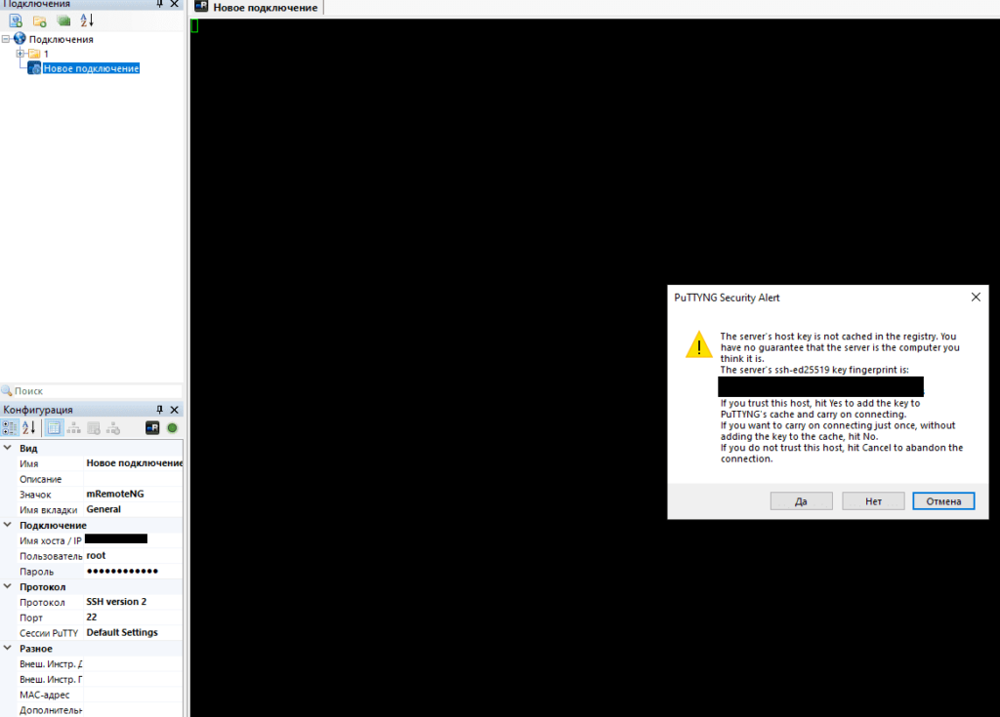
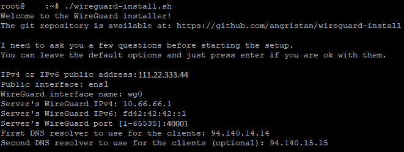
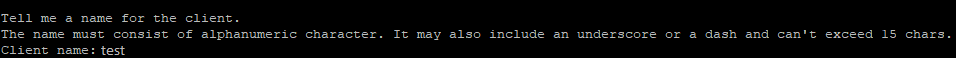
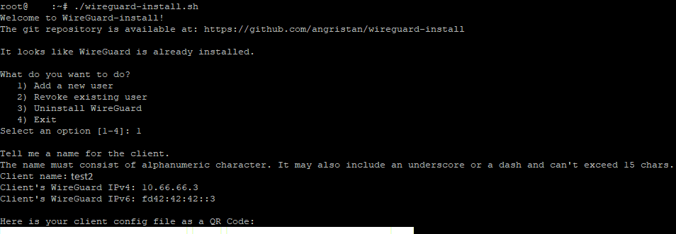

В статье будет рассмотрена установка и настройка Wireguard VPN. Можно использовать для установки соединения между клиентом (например телефон) и сервером, например для работы во внутренней сети, рабочих целей, настраивать будем на собственном сервере Linux.

В качестве рекомендации, можно выбрать подобного [хостинг провайдера](https://aeza.net/?ref=364032).

## Арендуем сервер

Можно арендавать небольшой VPS сервер на KVM, **так как OpenVZ НЕ ПОДДЕРЖИВАЕТСЯ**.  
Я использовал для тестов следующий сервер:  
\- 1 vCPU  
\- 8GB RAM  
\- 20GB Storage  
\- 100 Mbit/s - безлимитный трафик  
\- Debian 11

## Подключение к серверу по SSH

Для настройки, нам нужно подключиться по SSH к серверу. Для этого берём данные который прислал нам хостинг провайдер в письме или указал в личном кабинете. Нам нужен ip-адрес и пароль.

Чтобы подключиться по SSH, я буду использовать mRemoteNG, но можно и любую другую программу по типу PuTTY. Указываем ip-адрес, пользователь - root (если иного не указал провайдер), протокол SSH version 2, порт стандартный 22. 

[](https://young-admin.org.ru/wp-content/uploads/2022/09/ssh.png)

При подключении выйдет уведомление, можно нажать как "Да" так и "Нет". "Отмена" - сбросит соединение.

## Устанавливаем Wireguard и создаём клиента

Вначале проверим обновления:

```bash
apt-get update
```

И произведём установку обновлений:

```bash
apt-get upgrade
```

Далее установим серверную часть Wireguard, с помощью автоматического скрипта ["Angristan WireGuard install script"](https://github.com/angristan/wireguard-install):

```bash
curl -O https://raw.githubusercontent.com/angristan/wireguard-install/master/wireguard-install.sh
#Если выходит ошибка - "bash: curl: command not found", то устанавливаем curl
apt-get install curl

#Снова пробуем
curl -O https://raw.githubusercontent.com/angristan/wireguard-install/master/wireguard-install.sh

#Далее выдаём права на исполнение скрипту
chmod +x wireguard-install.sh

#И запускаем его
./wireguard-install.sh
```

Скрипт запустит установку и предварительно попросит проверить данные, такие как ip-адрес сервера, название интерфейсов, внутренний адрес Wireguard и порт, а также DNS сервер. Всё можно оставить по умолчанию, DNS сервера можно указать любые - по умолчанию предлагает DNS сервера Adguard.

<figure>

[](https://young-admin.org.ru/wp-content/uploads/2022/10/install-11.png)

<figcaption>

Выполнение скрипта и запрос на проверку данных.

</figcaption>

</figure>

Далее скрипт установит все необходимые пакеты, настроит их и последнее это запросит название для клиента, я для примера назвал его "test":

[](https://young-admin.org.ru/wp-content/uploads/2022/10/install-2.png)

Далее нас ещё раз спросят про ip-адрес но уже для клиента, можно оставить по умолчанию просто нажав enter.

Всё, Wireguard создал для нас конфиг клиента "test", и вывел в консоли в виде qr кода конфиг а также сохранил его в виде файла на сервере. Qr можно отсканировать с помощью приложения Wireguard на телефоне, а конфиг скинуть на любое устройство где планируется использвать данный VPN.

[](https://young-admin.org.ru/wp-content/uploads/2022/10/qr.png)

### Добавление нового клиента

Для добавления ещё одного клиента, просто запускаем повторно скрипт, выбираем первую опцию, указываем название клиента и получаем ещё одну конфигурацию:

[](https://young-admin.org.ru/wp-content/uploads/2022/10/qr-2.png)

## Защита сервера

Это общие рекомендации и минимальные действия для защиты, которые рекомендуется настраивать на любом вашем сервере.

\- Сменнить стандартный порт SSH, на [свободный](https://ru.wikipedia.org/wiki/%D0%A1%D0%BF%D0%B8%D1%81%D0%BE%D0%BA_%D0%BF%D0%BE%D1%80%D1%82%D0%BE%D0%B2_TCP_%D0%B8_UDP#%D0%9F%D0%BE%D1%8F%D1%81%D0%BD%D0%B5%D0%BD%D0%B8%D1%8F_%D0%BA_%D1%82%D0%B0%D0%B1%D0%BB%D0%B8%D1%86%D0%B5). Руководство по изменению порта будет [тут](#).  
\- Установить iptables и настроить [fail2ban](https://young-admin.org.ru/ustanovka-i-nastrojka-fail2ban/).
