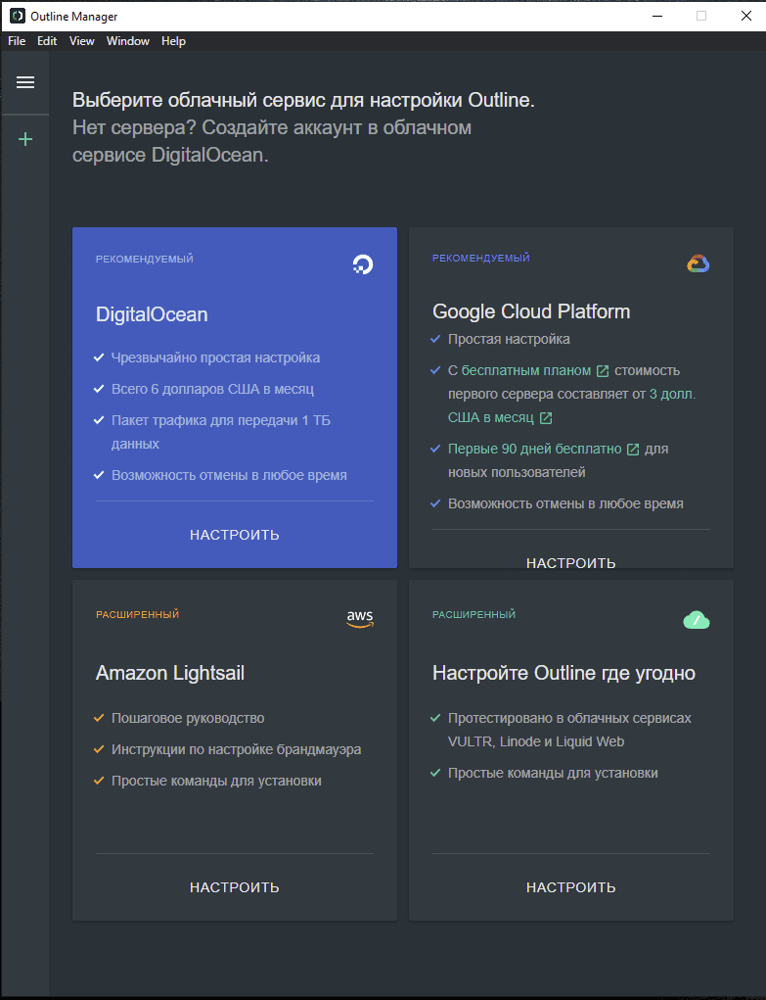
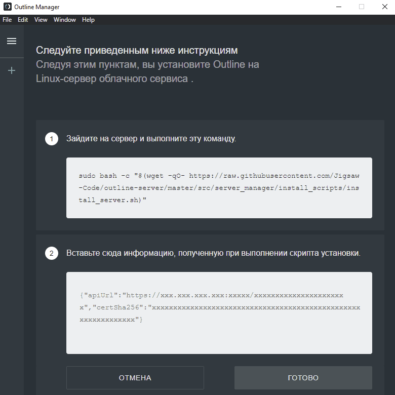
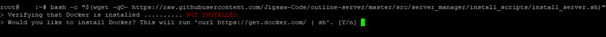
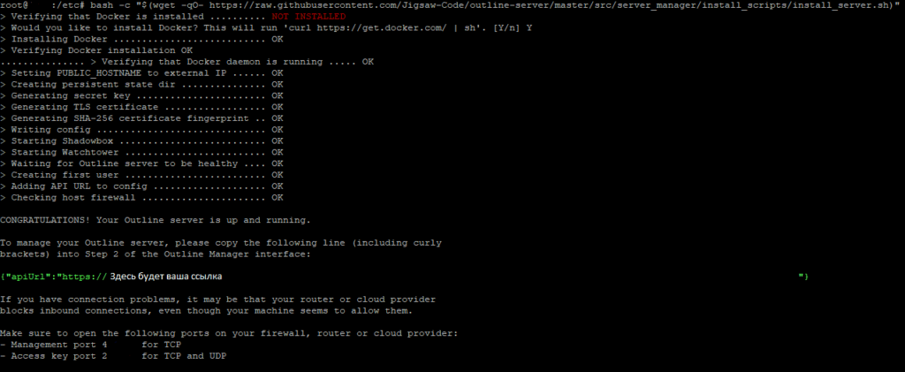
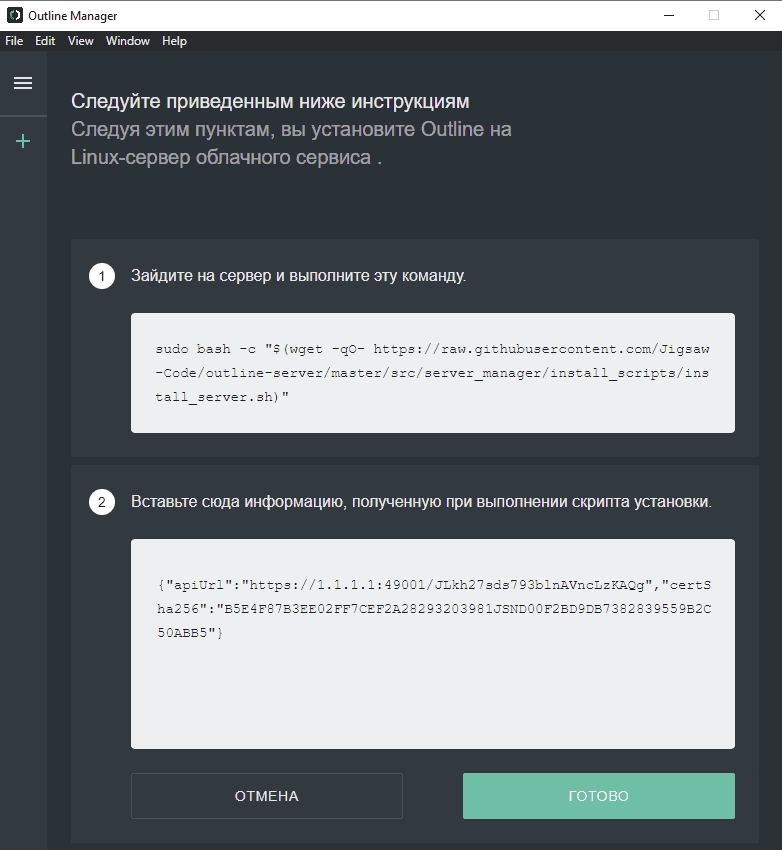
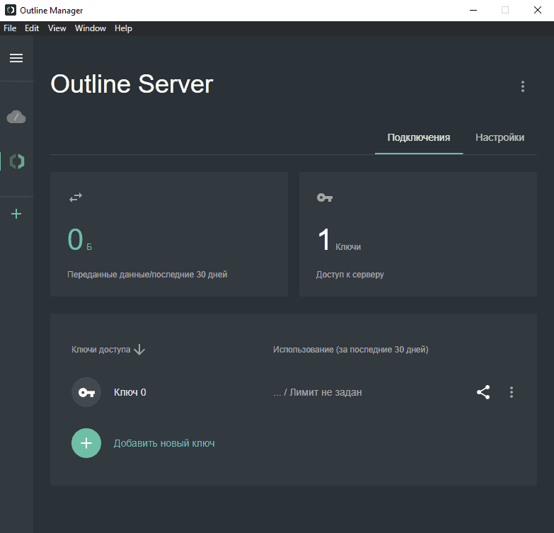
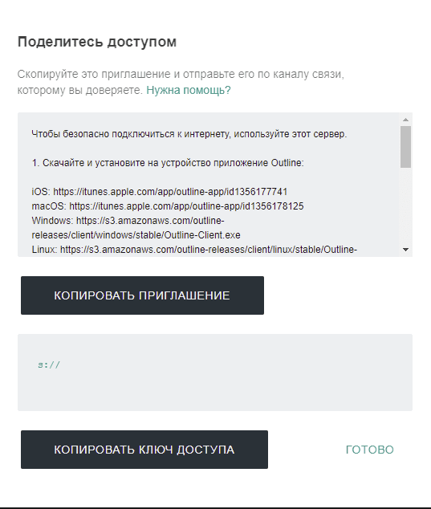
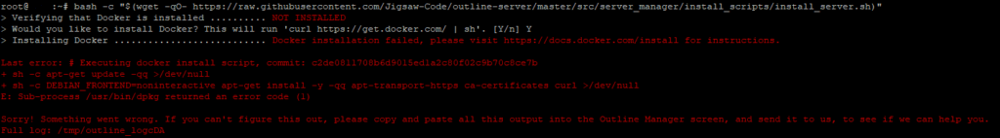

В статье будет рассмотрена установка и настройка VPN Outline. Можно использовать для установки соединения между клиентом (например телефон) и сервером, например для работы во внутренней сети, рабочих целей, настраивать будем на собственном сервере Linux.

В качестве рекомендации, можно выбрать подобного [хостинг провайдера](https://aeza.net/?ref=364032).

## Установка

Перед настройкой сервера, предлагается [установить и запустить](https://www.getoutline.org/ru/get-started/) Outline Manager, откуда возможно централизованно управлять всеми настройками. Также возможно выбрать один из предложенных облачных сервисов или использовать собственную инфраструктуру Linux для настройки сервера.

Скачиваем и запускаем установочник. После запуска Outline Manager соглашаемся с политикой, нажимаем "Настроить Outline где угодно". Далее появится команда для выполнения на сервере, копируем и идём на сервер.

[](https://young-admin.org.ru/wp-content/uploads/2023/06/outline-manager.png)

[](https://young-admin.org.ru/wp-content/uploads/2023/06/outline-manager-setup.png)

Первым делом на сервере запускаем обновление (команды для Ubuntu/Debian), добавьте sudo в начале команды если вы не под root:

```bash
apt-get update && apt-get upgrade -y
```

Далее скопированную команду из Outline Manager вводим в консоли, если вы на сервере под root, то sudo в начале команды нужно убрать:

```bash
sudo bash -c "$(wget -qO- https://raw.githubusercontent.com/Jigsaw-Code/outline-server/master/src/server_manager/install_scripts/install_server.sh)"
```

И выполняем на сервере, при проверке может сообщить что Docker не установлен, вводим Y и продолжаем.

[](https://young-admin.org.ru/wp-content/uploads/2023/06/docker-not-installed.png)

Если возникнет ошибка при установке Docker, вам может помочь [следующее](#Решение_проблем).

После того как завершится уставновка будет будет выведена в консоли ссылка, её копируем и перехоим к настройке:

[](https://young-admin.org.ru/wp-content/uploads/2023/06/ready.png)

## Настройка

Скопированный URL вставляем в Outline Manager (на картинке URL это не рабочий пример, не пытайтесь его использовать) и нажимаем готово:

[](https://young-admin.org.ru/wp-content/uploads/2023/06/outline-manager-url.png)

Появится окно с настройкой пользователей VPN, здесь можем добавлять ключи доступа и лимитировать им трафик. Также можно поделиться ключом для подключения, внутри описано подробно как это сделать, копируем заходим в приложение, вставляем, подключаемся и всё готово.

[](https://young-admin.org.ru/wp-content/uploads/2023/06/osnovnoj-ekran.png)

[](https://young-admin.org.ru/wp-content/uploads/2023/06/klyuch.png)

## Решение проблем

У меня возникла следующая ошибка:

[](https://young-admin.org.ru/wp-content/uploads/2023/06/docker-error.png)

Решеение ошибки:

```bash
chattr -i /etc/resolv.conf
dpkg --configure resolvconf
```

После выполнения команд, пробуем ещё раз [запустить установку](#Установка), должно всё заработать
