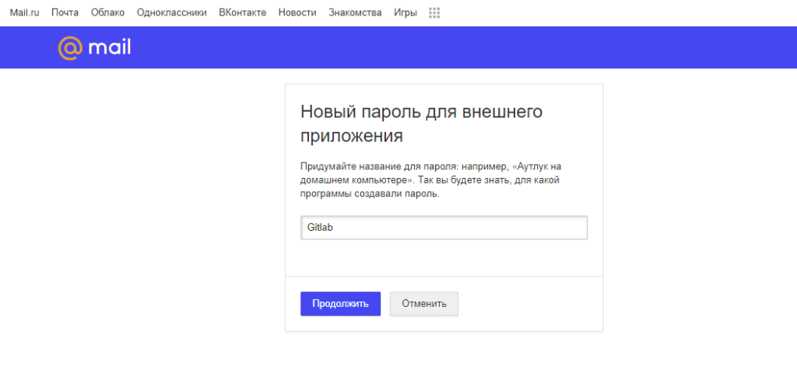
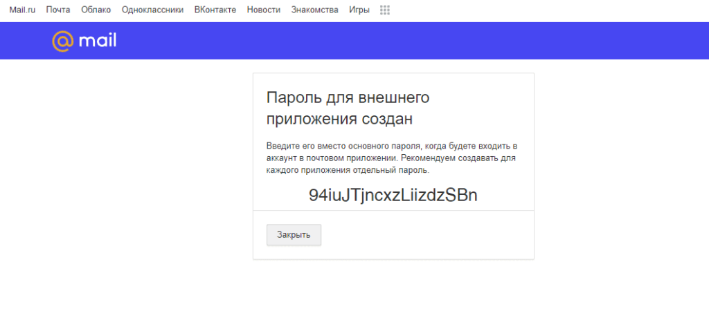

Подключим существующий аккаунт на почте mail.ru по SMTP к Gitlab, для получения уведомлений. Gitlab в моём случае запущен на Debian в облаке, но подходит решение и к другим конфигурациям.

## Создание пароля для внешнего приложения

Для работы Mail.ru почты по SMTP с Gitlab (или другими приложениями) нужно [создать](https://account.mail.ru/user/2-step-auth/passwords/add) "пароль для внешнего приложения". Даём понятное название для нашего пароля, проходим капчу и в конце получаем наш пароль - его лучше записать, выводится только один раз.

[](https://young-admin.org.ru/wp-content/uploads/2023/09/stranicza-parolya-dlya-vneshnego-prilozheniya-mail-ru.png)

[](https://young-admin.org.ru/wp-content/uploads/2023/09/parol-dlya-vneshnego-prilozheniya-mail-ru.png)

## Настройка Gitlab для работы с почтой

### Редактируем конфиг

Подключаемся к нашему серверу и переходим к редактированию файла gitlab.rb. Я использую в качестве редактора MC, можно использовать любой другой, например vi:

```bash
mcedit /etc/gitlab/gitlab.rb
```

Ищем следующие настройки - GitLab email server settings, если закомментированы, убираем комментарий. Редактируем их и приводим к такому виду, указывая свои данные:

```ruby
 gitlab_rails['smtp_enable'] = true
 gitlab_rails['smtp_address'] = "smtp.mail.ru"
 gitlab_rails['smtp_port'] = 465
 gitlab_rails['smtp_user_name'] = "example@mail.ru"
 gitlab_rails['smtp_password'] = "указываем пароль для внешнего приложения"
 gitlab_rails['smtp_domain'] = "здесь может быть как ваш приобритённый домен так и mail.ru"
 gitlab_rails['gitlab_email_from'] = 'example@mail.ru'
 gitlab_rails['smtp_authentication'] = "login"
 gitlab_rails['smtp_tls'] = true
 gitlab_rails['smtp_enable_starttls_auto'] = true
 gitlab_rails['smtp_openssl_verify_mode'] = 'peer'
```

### Применяем изменения и проверяем работу почты

Для применения внесённых изменений в конфиг, нужно запустить реконфигурацию из консоли Linux:

```bash
gitlab-ctl reconfigure
```

После реконфигурации можно сразу проверить работу, отправив тестовое письмо, например себе на почту. Для этого заходим в [Rails console](https://docs.gitlab.com/ee/administration/operations/rails_console.html):

```bash
gitlab-rails console -e production
```

И проверяем отправку с помощью команды:

```ruby
Notify.test_email('admin@example.com', 'Test', 'some test email').deliver_now
```

По итогу на указанный адрес должно прийти тестовое письмо. Настройка почты для Gitlab закончена.
