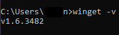
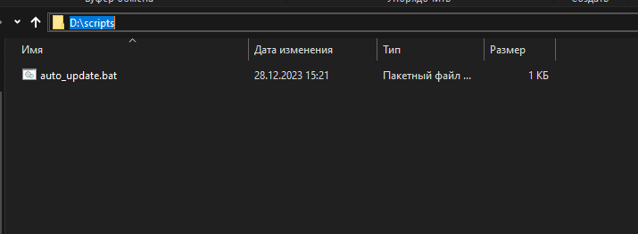
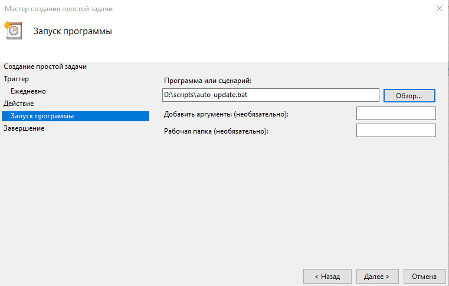
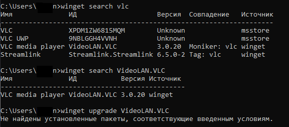

Некоторые программы не имеют встроеной системы автоматического обновления, но могут выводить сообщения о том, что доступна новая версия. Данные уведомления мне надоели, решено их обновлять автоматически, когда компьютер например не используется, другими средствами. Для этого можно воспользоваться пакетным менеджером встроенным в Windows 10/11 - это Winget.

Также есть [другой способ](https://young-admin.org.ru/avtomatizacziya-ustanovki-programm-na-windows/) установки и обновления программ, с помощью сторонней программы Chocolatey.

## Что необходимо для работы WinGet

Winget встроен с версий Windows 10 21H1 и Windows 11 21H2 и новее.  
Чтобы проверить его наличие, достаточно открыть командную строку Windows и ввести, например, команду:

```powershell
winget -v
```

В выводе, вы должны получить версию программы, в моём случае это v1.6.3482. Если вы получили версию, то пакетный менеджер у вас уже имеется и можно идти к следуюему шагу. Если нет, то его необходимо установить. Установить можно из [Microsoft Store](https://www.microsoft.com/p/app-installer/9nblggh4nns1).

<figure>

[](https://young-admin.org.ru/wp-content/uploads/2023/12/winget-version.png)

<figcaption>

Вывод версии Winget

</figcaption>

</figure>

## Написание скрипта

Перед началом опишу несколько моментов. Winget не всегда может обновить программы, если они запущены. Например Hwmonitor у меня без проблем сам закрылся и обновился, а при открытом Notepad++ выполнение завершилось ошибкой, как только закрыл - всё прошло успешно.

Создадим файл с помощью любого текстового редактора с названием auto\_update и расширением .bat. Я сохраню его на диск D в папку "Scripts" (D:\\scripts), этот путь нам понадобиться позже в планировщике задач Windows. Вы также можете сохранить в любом другом месте.

[](https://young-admin.org.ru/wp-content/uploads/2023/12/put-do-bat-fajla2.png)

  
Для обновления можно указывать как имя пакета, так и идентификатор, я буду использовать идентификатор - он уникален. Чтобы найти идентификатор, например для VLC, достаточно написать в консоли winget search vlc. Внутри созданного файла "auto\_update.bat" указываем следующее:

```powershell
winget upgrade Notepad++.Notepad++ CPUID.HWMonitor
```

## Создание задания в планировщике

Заходим в "Планировщик заданий" для этого, нажимаем win + r, вводим taskschd.msc и нам откроется планировщик. Создаём простую задачу:  
\- Имя - рекомендую указывать отражающую суть данного задания  
\- Триггер - я выбрал ежедневно, т.е. задача будет срабатывать каждый день  
\- Далее можно будет указать дату и время, начала, работы данной задачи, и указать повтор  
\- Действие - выбираем "запустить программу"  
\- Нам предложит указать путь до файла, нажимаем обзор и выбираем ранее созданный файл "auto\_update.bat"

[](https://young-admin.org.ru/wp-content/uploads/2023/12/planirovshhik-zadanij.png)

В конце нажимаем готово, наше задание создано. Теперь наш скрипт с вызовом winget и обновлением будет запускаться по расписанию и обновлять указанные пакеты.

## Возможные проблемы

Я столкнулся с тем что не находит VLC media player по ИД - VideoLAN.VLC при выполнении команды обновления из батника. При этом если в консоли прописать:

```powershell
winget search VideoLAN.VLC
```

То пакет находит, но при этом если также из консоли ввести команду обновления, то также не находит установленный пакет:

[](https://young-admin.org.ru/wp-content/uploads/2023/12/winget-nothing-found.png)

Проверить пока нет времени, но думаю решение подобной проблемы - удалить программу стандартными средствами Windows и после установить уже из репозитория с помощью Winget.
