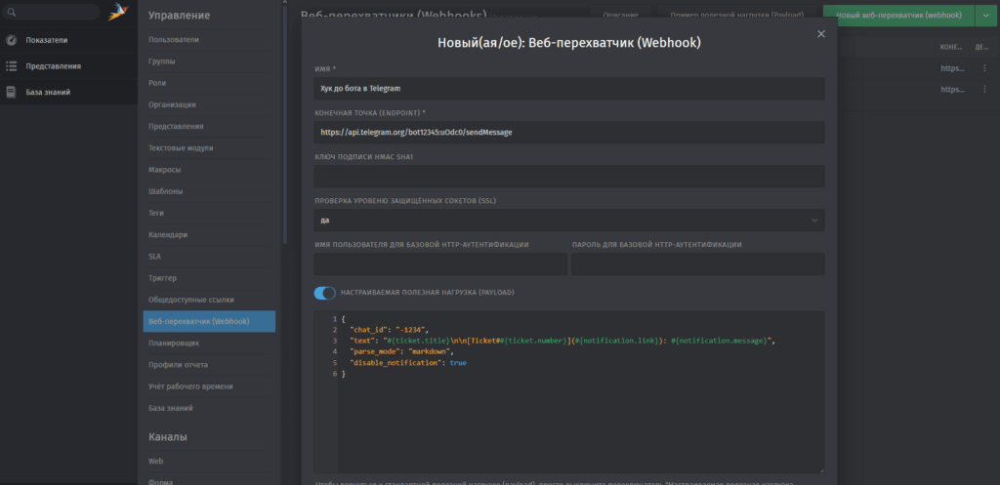
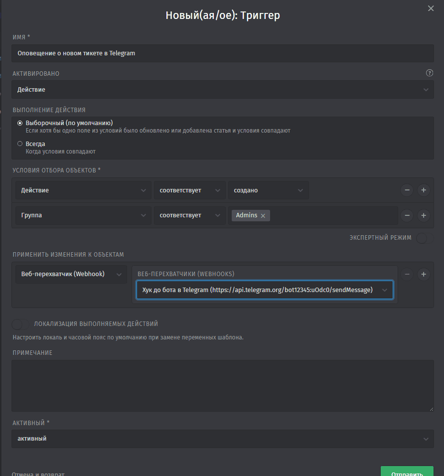

Для получения оповещений о новых тикетах или другой информации из оных, в групповом чате Telegram через Webhook. Бот предварительно должен быть добавлен в групповой чат.

## Создание Webhook

Заходим в настройки, управление, Webhooks и добавляем новый "Веб-перехватчик":  
\- Имя - указываем любое, понятное;  
\- Endpoint - [ссылка на api](https://core.telegram.org/bots/api#making-requests) с вашим токеном для доступа к боту в Telegram. Токен можно получить у [BotFather](https://t.me/BotFather):

```markup
https://api.telegram.org/bot<token>/sendMessage
```

[](https://young-admin.org.ru/wp-content/uploads/2024/10/webhook-zammad-1.png)

Данные для Payload:

\- chat\_id - id вашего группового чата, узнать его можно пригласив в него [подобного бота](https://t.me/getmyid_bot);  
\- text - указываем информацию которую хотим получить в уведомлении. У меня это заголовок тикета, его номер с ссылкой, кем создан, дата и время. На этой же странице есть пример Payload, где можно подобрать свои данные для сообщения;  
\- Disable\_notification - не обязателен можете оставить или убрать, пользователи получат уведомление без звука.

```json
{
  "chat_id": "-1234",
  "text": "#{ticket.title}\n\n[Ticket##{ticket.number}](#{notification.link}): #{notification.message}",
  "parse_mode": "markdown",
  "disable_notification": true
}
```

## Настраиваем тип уведомлений

Переходим в настройки, управление, триггер и создаём новый.

\- Имя - указываем любое, понятное;  
\- Условия отбора - я выбрал действия на создание нового тикета и группу пользователей, для кого будет работать этот триггер  
\- Применить изменение к объектам - выбираем Webhook и наш созданный "Хук до бота в Telegram"

[](https://young-admin.org.ru/wp-content/uploads/2024/10/trigger-na-novyj-tiket.png)

Сохраняем и проверяем, создав новый тикет. Оповещение должно поступить в указанный вами групповой чат, от вашего бота, а в журнале настройки -> управление -> Webhooks - появится запись с 200-м кодом.
