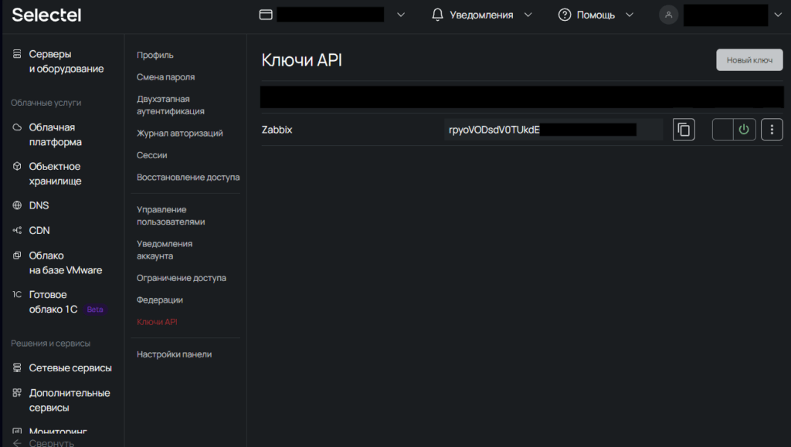

Ставим на мониторинг баланс счета, с графиком изменения суммы счета и триггер при критическом остатке средств. При срабатывания триггера будем получать уведомления.

## Введение

Цель - держать на мониторинге баланс и быть уверенным, что денежные средства не закончились. Мониторинг будет висеть на хосте Zabbix сервера, через агента.

- Установим на Zabbix сервере - jq, если он ещё не установлен, для работы с API

- Создадим bash скрипт для отправки запроса и обработки полученных данных

- Добавим свой [user parameter](https://www.zabbix.com/documentation/current/en/manual/config/items/userparameters) для Zabbix

- Добавим элемент данных, триггер, график и сделаем [шаблон](#Импорт_шаблона_для_Zabbix) для импорта в Zabbix

## Получение ключа API в Selectel

Заходим в личный кабинет (ЛК) Selectel и переходим в раздел "[Ключи API](https://my.selectel.ru/profile/apikeys)". Нажимаем "Новый ключ", даём ему осмысленное название, например "Zabbix" и получаем ключ. Ключ записываем или оставляем вкладку открытой, позже к нему вернёмся.

[](https://young-admin.org.ru/wp-content/uploads/2024/02/selectel-lichnyj-kabinet.png)

## Установка jq

Selectel отдаёт данные через API в формате json. Чтобы забрать необходимую информацию, в нашем случае, общий суммарный баланс, на сервере устанавливаем jq:

Debian/Ubuntu:

```bash
apt-get install jq
```

Проверяем что jq установился, отправив команду на вывод версии:

```bash
jq -V
#Если команда выполнилась и вышла версия, то идём дальше, например:
jq-1.6
```

## Создание скрипта

Создадим папку, если её ещё нет и проверьте что у Zabbix есть права доступа на каталог и файлы внутри:

```bash
mkdir /etc/zabbix/scripts
```

Создадим файл скрипта в папке /etc/zabbix/scripts/:

```bash
mcedit /etc/zabbix/scripts/selectel_balance.sh
```

И пишем скрипт в данном файле, единственное указываем в selectel\_token свой ключ, который [ранее получили](#Получение_ключа_API_в_Selectel):

```bash
#!/bin/bash

#Var
selectel_token="abc_123"

#Request & formatting a number
curl -s \
-H "X-Token: $selectel_token" \
-H 'Content-Type: application/json' \
https://api.selectel.ru/v3/balances | jq -r '.data.billings[].balances_values_sum' | sed 's/..$/.&/g'
```

Сохраняем и даём права на выполнение:

```bash
chmod +x /etc/zabbix/scripts/selectel_balance.sh
```

### Подключаем скрипт к Zabbix агенту

Создаём файл selectel\_api.conf в каталоге /etc/zabbix/zabbix\_agentd.d/, с нашим user parameter, чтобы Zabbix мог с помощью него вызывать скрипт:

```bash
mcedit /etc/zabbix/zabbix_agentd.d/selectel_api.conf
```

Содержание конфига, обратите внимание файл не должен заканчиваться с новой строки, иначе будет ошибка в Zabbix:

```bash
UserParameter=billings.balances_values_sum, /bin/bash /etc/zabbix/scripts/selectel_balance.sh
```

Скрипт отправляет запрос, оставляет только информацию по общему балансу.

Уведомления будут приходить при срабатывания триггера, если у вас настроены хотя бы один из доступных [каналов](https://www.zabbix.com/features?utm_campaign=mainpage&utm_source=website&utm_medium=header#alerting).

## Импорт шаблона для Zabbix

В шаблоне заготовлен график, item, и триггер который срабатывает если баланс ниже 1500. Триггер рекомендую отредактировать на необходимую вам сумму. Загрузить файл шаблона можно [здесь](https://github.com/yoa-lab/Selectel-balance-in-Zabbix/blob/main/zbx_selectel_template.xml). Скачиваем файл, заходим в Zabbix Server в шаблоны и импортируем файл со всеми параметрами по умолчанию, подробнее можно прочитать [здесь](https://www.zabbix.com/documentation/current/en/manual/xml_export_import/templates#importing) и подключаем шаблон к Zabbix серверу в моём случае.

## На каких версиях работает шаблон?

Шаблон вместе со скриптом проверен и работает на Zabbix 5.x и на Zabbix 7.2.x.
